\thispagestyle{empty}

\begin{center}

\vspace*{1cm}

{\Large \textbf{A MOBILE APPLICATION PROJECT REPORT ON}}

\vspace{0.8cm}

{\huge \textbf{PlayArena}}

\vspace{0.8cm}

{\large \textbf{Submitted To: GUJARAT UNIVERSITY (2025-2026)}}

\vspace{1cm}

\textit{[Gujarat University Logo]}

\vspace{0.6cm}

\textbf{GUJARAT UNIVERSITY} \\
Estd. 1949

\vspace{0.8cm}

In Partial Fulfillment of \textbf{Bachelor of Computer Application (BCA)}

\vspace{0.8cm}

\textit{[Shayona / President Institute Logo]}

\vspace{0.4cm}

President Institute of Computer Application

Shayona Study Campus, Shayona City, Ghatlodiya, Ahmedabad, Gujarat-380061

\vspace{1cm}

\end{center}

| **Name** | **Enrollment Number** | **Roll Number** |
|:---:|:---:|:---:|
| Finaviya Dhruvil Nareshbhai | 202312102176 | 5111 |
| Bambhaniya Pratik Jagdishbhai | 202312102136 | 5199 |
| Hariyani Sujal Mukeshbhai | 202312102195 | 5215 |

\newpage

\thispagestyle{empty}
\begin{center}

\vspace*{2cm}

{\Huge \textbf{\textcolor{blue}{PlayArena}}}

\vspace{3cm}

\textit{[PlayArena App Logo]}

\vspace{3cm}

\textbf{\Large Submitted at}

\vspace{0.5cm}

\textbf{\Large GUJARAT UNIVERSITY}

\vspace{0.3cm}

\textbf{\Large \&}

\vspace{0.3cm}

\textbf{\Large PRESIDENT INSTITUTE OF COMPUTER APPLICATION}

\end{center}

\newpage

# College Certificate

\vspace{4cm}

\begin{center}
\textit{[This page will contain the scanned college certificate issued by President Institute of Computer Application, signed by the Principal and Project Guide.]}
\end{center}

\newpage

# Company Certificate

\vspace{4cm}

\begin{center}
\textit{[This page will contain the scanned company certificate issued by Jeritech, confirming the completion of the internship and project development.]}
\end{center}

\newpage

# ACKNOWLEDGEMENT

I would like to express my sincere gratitude to my project guide **Prof. AyushSingh Kushwaha** for her valuable guidance, support, and encouragement throughout the development of this project.

We owe our deep gratitude to our project guide **Prof. AyushSingh Kushwaha**, who took keen interest in our project work and guided us all along, till the completion of our project work by providing all the necessary information for developing a good system.

I also wish to extend my sincere thanks to **Mr. Arpan Vaghasiya** and the entire team at **Jeritech** for providing the opportunity to work on this live project during the internship. Their mentorship, technical inputs, and industry exposure were extremely helpful in shaping the final outcome of this project.

I extend my thanks to my friends for their cooperation and constructive feedback during the project work.

Finally, I am deeply grateful to my family for their constant encouragement and moral support which helped me complete this project successfully.

\vspace{1.5cm}

Finaviya Dhruvil

Bambhaniya Pratik

Hariyani Sujal

\newpage

# Index

| **SR NO.** | **PARTICULARS** | **PAGE NO.** |
|:---:|:---|:---:|
| 1 | Title Page | 2 |
| 2 | Certificate | 3 |
| 3 | Acknowledgement | 5 |
| 4 | Company Profile | 8 |
| 5 | Project Profile | 9 |
| 6 | Introduction | 10 |
| 7 | Tools and Technologies Used | 13 |
| 8 | Feasibility Study | 14 |
| 9 | Software Requirements Specification (SRS) | 15 |
| 10 | Modules | 20 |
| 11 | Module Hierarchy | 23 |
| 12 | System Architecture | 25 |
| 13 | System Flow Diagram | 28 |
| 14 | UML Diagrams | 31 |
|   | &nbsp;&nbsp;&nbsp;➢ Use Case Diagram | 34 |
|   | &nbsp;&nbsp;&nbsp;➢ Activity Diagram | 39 |
|   | &nbsp;&nbsp;&nbsp;➢ Sequence Diagram | 45 |
|   | &nbsp;&nbsp;&nbsp;➢ Class Diagram | 52 |
| 15 | ER Diagram | 58 |
| 16 | Data Dictionary | 63 |
| 17 | User Layout (Screenshots) | 72 |
|   | 17.1 Splash / Onboarding | 73 |
|   | 17.2 User Registration | 74 |
|   | 17.3 User Login (Email / OTP) | 75 |
|   | 17.4 Home / Dashboard | 76 |
|   | 17.5 Venue Listing | 77 |
|   | 17.6 Venue Detail | 78 |
|   | 17.7 Select Sport & Slot | 79 |
|   | 17.8 Booking Confirmation | 80 |
|   | 17.9 Payment | 81 |
|   | 17.10 Payment Success / Receipt | 82 |
|   | 17.11 My Bookings | 83 |
|   | 17.12 Matchmaker | 84 |
|   | 17.13 Tournaments | 85 |
|   | 17.14 Profile & Settings | 86 |
| 18 | Admin Layout (Screenshots) | 87 |
|   | 18.1 Admin Login | 88 |
|   | 18.2 Admin Dashboard | 89 |
|   | 18.3 Manage Venues | 90 |
|   | 18.4 Manage Slots | 91 |
|   | 18.5 Manage Bookings | 92 |
|   | 18.6 Venue-wise Bookings | 93 |
|   | 18.7 Admin Profile | 94 |
| 19 | Future Enhancement | 95 |
| 20 | Conclusion | 96 |
| 21 | References / Bibliography | 97 |
| 22 | Log-sheet | 98 |

\newpage

# Company Profile

\begin{center}
\textit{[Jeritech Logo]}
\end{center}

- **Jeritech** is a technology-oriented organization that provides software development services, technical solutions, and internship opportunities for students and professionals. The company focuses on developing modern mobile applications, web platforms, and innovative technology solutions for businesses and individuals.

- Jeritech supports students by providing real-world project experience, technical mentorship, and exposure to modern development tools and frameworks such as **Flutter, Firebase, and BLoC**. Through this internship opportunity, students gain practical knowledge in full-stack mobile application development, cloud-based system design, and end-to-end software implementation.

- The project **"PlayArena — Book, Play, Connect"** was developed during the internship period under the guidance and support of Jeritech.

\vspace{0.5cm}

| **Field** | **Details** |
|:---|:---|
| Company Name | Jeritech |
| Company Person | Arpan Vaghasiya |
| Contact No. | +91 9023848330 |
| Email ID | Jeri.technology34@gmail.com |
| Address | C-503, Giriraj Enclave, nr. Danev Super Market, Avkash Park Society, Nikol, Ahmedabad, Gujarat 380049 |
| Website | www.jeritech.in |

\newpage

# PROJECT PROFILE

| **Field** | **Details** |
|:---|:---|
| **Project Name** | PLAYARENA |
| **Objective** | The main objective of PlayArena is to provide a unified mobile platform that lets users discover nearby sports venues, book time slots for multiple sports (box cricket, football, pickleball, badminton, tennis), make secure online payments, find players for pickup matches, and participate in tournaments. The system also provides dedicated admin and ground-manager dashboards to manage venues, slots, bookings, users and payments in real time. |
| **Group No** | 13 |
| **Group Members** | 3 |
| **Team Members** | - Finaviya Dhruvil Nareshbhai \newline - Bambhaniya Pratik Jagdishbhai \newline - Hariyani Sujal Mukeshbhai |
| **Platform** | Mobile Application (Android & iOS) |
| **Framework** | Flutter (Dart) |
| **Backend** | Firebase (Firestore, Authentication, Storage, Crashlytics) |
| **State Management** | BLoC (flutter\_bloc) |
| **Institute** | President Institute of Computer Application |
| **University** | Gujarat University (2025-2026) |
| **Internship** | Jeritech, Ahmedabad |
| **Guide** | Prof. AyushSingh Kushwaha |

\newpage

# INTRODUCTION

### Welcome to PlayArena

**The easiest way to book, play, and connect with sports lovers around you!**

**PlayArena** is a modern cross-platform mobile application designed to simplify the way users discover, reserve, and enjoy sports experiences in their local area. The system allows users to explore a wide range of sports venues, view detailed information about each venue's facilities, sports offered, ratings and pricing, and book time slots instantly based on their preferred sport, date and location.

With PlayArena, users can easily find nearby sports venues for **box cricket, football, pickleball, badminton, and tennis**, check real-time slot availability, compare peak-hour and happy-hour pricing, and make secure bookings without any hassle. Whether a user is looking for solo practice, a friendly match with friends, a pickup game with strangers of similar skill level, or participating in organized tournaments — PlayArena provides a seamless, end-to-end experience.

The application also includes a dedicated **Matchmaker** module that allows players to host open matches or respond to "looking for players" requests, making it easy for new players in a city to connect with a community of sports enthusiasts. A **Tournaments** module lets venue owners organize professional knockout, round-robin or league events and lets teams register and track fixtures inside the app.

Designed with modern technology — **Flutter** on the client side and **Firebase** on the server side — PlayArena focuses on convenience, efficiency and reliability. Features such as instant booking confirmation, secure integrated payment, QR-code based venue entry, split-payment among friends, real-time slot synchronisation and push notifications make the entire process smooth and trustworthy.

Our mission is to create a connected sports community where players can not only book slots but also discover new sports, connect with teammates and opponents, and enjoy a complete sports-entertainment experience — all from a single mobile app.

\newpage

# EXISTING SYSTEM

- The existing system for booking sports venues is largely **manual and fragmented**.
- Users typically have to physically visit the ground, call the manager on WhatsApp or telephone, or send messages on Instagram to check availability and block a slot.
- This process **wastes a lot of time** — especially during peak evening and weekend hours when lines are busy and multiple users compete for the same slot.
- Payments are usually made in **cash or by manual UPI transfer** with no formal receipt, which creates disputes and a lack of trust.
- There is **no centralised view** of nearby venues — a user cannot compare price, rating, facility and distance in one place.
- **New players** in a city cannot easily connect with other gamers or form teams for pickup matches.
- Tournaments are announced through posters or word-of-mouth, causing **low visibility and poor participation**.
- Venue owners have no clean system to track bookings, payments, customer history or peak-hour demand — everything is maintained in paper diaries or scattered Excel files.
- There is **no online option** for live slot booking, refunds, or customer feedback.

\newpage

# PROPOSED SYSTEM

- We have developed a new system based on a **cross-platform mobile application** built using Flutter and Firebase.
- The app reduces complexity and efficiently handles large volumes of real-time data through Cloud Firestore.
- Players do not need to visit the ground or contact staff in person — they can see all venues, filter by sport and price, and book a slot from home.
- They **don't have to wait** for their slot anymore — availability is shown in real time and slots are reserved atomically so double-booking is impossible.
- Users can **book slots, make secure online payments, give ratings, connect with other players**, and join tournaments — all from a single app.
- The **Matchmaker** module lets users host or join pickup matches based on sport, skill level and location.
- A **Tournaments** module lets organisers run knockout, round-robin or league events with team registration, fixture generation and score tracking.
- **Split Payment** lets friends share the booking cost — each user pays their portion directly.
- **QR code based entry** removes manual verification at the venue gate.
- A dedicated **Admin / Ground Manager Dashboard** gives owners real-time visibility of bookings, revenue, pending slots, user feedback and venue performance.
- The system is more **secure and user-friendly** — powered by Firebase Authentication (email + phone OTP) with role-based access for Player, Admin and Ground Manager.
- This saves a lot of time and effort for both users and venue owners.

\newpage

# Tools and Technologies Used

**Frontend / Mobile Client:**

- Flutter (cross-platform UI framework)
- Dart (programming language)
- Material 3 Design System

**State Management:**

- flutter_bloc (BLoC pattern)
- Equatable (value equality)

**Backend (Cloud / Serverless):**

- Firebase Authentication (email + phone OTP)
- Cloud Firestore (NoSQL real-time database)
- Firebase Storage (venue images, user avatars)
- Firebase Crashlytics (error monitoring)

**Navigation:**

- GoRouter (declarative routing)

**Payments:**

- Razorpay / UPI (secure online payment)

**Other Libraries:**

- image_picker (upload photos)
- cached_network_image (image caching)
- qr_flutter (QR code generation for booking entry)
- intl (date/time formatting)

**Development Tools:**

- IDE: Visual Studio Code, Android Studio
- Version Control: Git, GitHub
- Design: Figma
- Testing: Flutter Test, Firebase Emulator Suite
- AI assistance: ChatGPT, GitHub Copilot

**Platforms Supported:**

- Android (API 21+)
- iOS (iOS 12+)
- Web (secondary, for admin panel)

\newpage

# Feasibility Study

## 1. Technical Feasibility

- All required technologies — **Flutter, Firebase, Dart** — are open-source, well-documented and have strong community support.
- Firebase provides a managed backend (Auth, Firestore, Storage, Cloud Functions) with a generous free tier suitable for a student project.
- The development team has working knowledge of Flutter, Dart and Firebase.
- The application can run on both Android and iOS from a single code base, reducing development effort significantly.
- Firestore's real-time listeners eliminate the need for custom WebSocket servers for live slot updates.

## 2. Economic Feasibility

- Payments are **digital, secure and instant** for both the user and the venue owner — reducing cash-handling overhead.
- Firebase's pay-as-you-go model means the operational cost scales only with usage; small volumes are effectively free.
- The system reduces the need for paper registers, printed receipts and manual staff at reception — lowering the venue's operating cost.
- Venue owners gain better price optimisation through **peak-hour and happy-hour pricing**, improving revenue.
- Split-payment reduces failed bookings caused by one friend not having enough balance.

## 3. Operational Feasibility

- Easy to operate for both players and venue administrators.
- Can be accessed from any smartphone (Android / iOS) — no need for dedicated hardware.
- Simple, modern Material 3 interface with consistent navigation.
- Offline-friendly: Firestore caches recent data locally so the app works on flaky networks.
- Role-based access (Player / Admin / Ground Manager) ensures users only see what's relevant to them.

\newpage

# SOFTWARE REQUIREMENTS SPECIFICATION (SRS)

## 1. Purpose

The Software Requirements Specification (SRS) describes the functional and non-functional requirements of the **PlayArena** mobile application. It is intended as the authoritative reference for:

- The development team building the system.
- The project guide — **Prof. AyushSingh Kushwaha**.
- The evaluators at **Gujarat University**.
- The technical mentors at **Jeritech**.

The SRS fixes *what* the system must do; *how* it does it is covered in the System Architecture and UML chapters.

## 2. Scope

PlayArena is a cross-platform (**Android + iOS**) Flutter application backed by **Firebase**. Its scope covers three types of users:

- **Player** — registers, discovers venues, books slots, pays online, joins pickup matches and tournaments, gives reviews.
- **Ground Manager** — manages his own venues, slots, pricing, and sees venue-wise bookings and revenue.
- **Super Admin** — platform-wide control: create/verify venues, manage all users, approve tournaments, refund bookings.

Out of scope for this release:

- Physical hardware at venue gates (turnstiles, RFID).
- Real-time video streaming of tournaments.
- AI-driven player recommendation engine (planned for future).

\newpage

## 3. Functional Requirements

### 3.1 User (Player) Module

| **ID** | **Requirement** | **Priority** |
|:---:|:---|:---:|
| FR-U-01 | The system shall allow a new user to register with name, email, phone and password. | HIGH |
| FR-U-02 | The system shall verify the user's phone via Firebase OTP before activation. | HIGH |
| FR-U-03 | The system shall allow registered users to log in via email + password or phone + OTP. | HIGH |
| FR-U-04 | The system shall allow users to reset forgotten passwords via email link. | MEDIUM |
| FR-U-05 | The system shall display a paginated list of nearby venues filtered by sport, rating and price. | HIGH |
| FR-U-06 | The system shall show **real-time** slot availability for a selected venue, sport and date. | HIGH |
| FR-U-07 | The system shall atomically reserve a slot when a booking payment succeeds so **double-booking is impossible**. | HIGH |
| FR-U-08 | The system shall allow split payment of a booking with up to 8 friends. | MEDIUM |
| FR-U-09 | The system shall generate a unique QR code for every confirmed booking, usable at the venue gate. | HIGH |
| FR-U-10 | The system shall allow the user to cancel a booking; refunds are governed by the venue's policy. | MEDIUM |
| FR-U-11 | The system shall allow users to host a pickup match with sport, date/time, max players, skill level and cost per player. | HIGH |
| FR-U-12 | The system shall allow users to join an existing pickup match if seats are available. | HIGH |
| FR-U-13 | The system shall allow users to post a "looking for players" match request. | MEDIUM |
| FR-U-14 | The system shall allow users to browse tournaments and register as a team. | MEDIUM |
| FR-U-15 | The system shall allow users to submit a review and a rating (1–5 stars) for a completed booking. | MEDIUM |
| FR-U-16 | The system shall let users view, filter and sort their booking history. | HIGH |
| FR-U-17 | The system shall let users mark venues as favourites for faster access. | LOW |
| FR-U-18 | The system shall let users update their profile, change avatar and manage membership tier. | MEDIUM |

\newpage

### 3.2 Admin / Ground-Manager Module

| **ID** | **Requirement** | **Priority** |
|:---:|:---|:---:|
| FR-A-01 | The system shall restrict admin routes to users with `role == admin` or `role == groundManager`. | HIGH |
| FR-A-02 | The system shall allow admins to create, edit and delete venues with images, amenities and pricing tiers. | HIGH |
| FR-A-03 | The system shall allow admins to generate slots in bulk for the next 7 or 30 days. | HIGH |
| FR-A-04 | The system shall allow admins to block individual slots (e.g. for maintenance). | HIGH |
| FR-A-05 | The system shall allow admins to view, filter and cancel any booking. | HIGH |
| FR-A-06 | The system shall allow admins to scan a booking QR code at the venue gate to verify entry. | MEDIUM |
| FR-A-07 | The system shall allow admins to view aggregate KPIs — total users, venues, bookings, feedback. | HIGH |
| FR-A-08 | The system shall allow admins to create and publish tournaments in knockout / round-robin / league format. | MEDIUM |
| FR-A-09 | The system shall allow admins to view and respond to user reviews. | LOW |
| FR-A-10 | The system shall allow admins to suspend abusive users and promote players to ground managers. | MEDIUM |

### 3.3 System-wide Functional Requirements

| **ID** | **Requirement** | **Priority** |
|:---:|:---|:---:|
| FR-S-01 | The system shall authenticate every request to Firestore using Firebase Auth tokens. | HIGH |
| FR-S-02 | The system shall enforce role-based access via Firestore Security Rules. | HIGH |
| FR-S-03 | The system shall log unhandled exceptions to Firebase Crashlytics. | MEDIUM |
| FR-S-04 | The system shall show connection-loss banners and queue writes while offline. | MEDIUM |
| FR-S-05 | The system shall cache recent queries locally for faster subsequent reads. | LOW |

\newpage

## 4. Non-Functional Requirements

| **ID** | **Category** | **Requirement** | **Target** |
|:---:|:---|:---|:---|
| NFR-01 | Performance | Time to display venue list after login | ≤ 3 seconds on 4G |
| NFR-02 | Performance | Time to confirm a booking after payment success | ≤ 5 seconds |
| NFR-03 | Scalability | System shall handle concurrent users reading slots | ≥ 1,000 (Firestore) |
| NFR-04 | Reliability | Monthly uptime | ≥ 99.5% |
| NFR-05 | Security | All network traffic encrypted | TLS 1.2+ (HTTPS) |
| NFR-06 | Security | Passwords stored only as Firebase Auth bcrypt hash | Never plain text |
| NFR-07 | Usability | New user to first booking | ≤ 5 minutes |
| NFR-08 | Portability | Supported mobile platforms | Android 5+, iOS 12+ |
| NFR-09 | Maintainability | Code must follow BLoC + Clean Architecture | Required |
| NFR-10 | Availability | Offline-first data access for bookings | Read-only cached |
| NFR-11 | Accessibility | Supports system-level dynamic text sizing | Yes |
| NFR-12 | Localisation | UI supports LTR languages | English (v1), Hindi/Gujarati (future) |

\newpage

## 5. Hardware Requirements

### 5.1 Developer Side (minimum)

| **Component** | **Specification** |
|:---|:---|
| Processor | Intel i5 / Apple M1 or higher |
| RAM | 8 GB (16 GB recommended) |
| Storage | 256 GB SSD |
| Display | 1920×1080 or higher |
| Internet | Stable broadband (≥ 10 Mbps) |

### 5.2 End-User Side

| **Component** | **Specification** |
|:---|:---|
| Device | Android 5.0+ smartphone or iPhone (iOS 12+) |
| RAM | ≥ 2 GB |
| Storage | ≥ 200 MB free |
| Network | 3G / 4G / 5G / Wi-Fi |
| Camera | Required for QR scan at venue entry |

### 5.3 Server Side

The server side is fully **managed by Firebase (Google Cloud)**. No physical hardware is maintained by the team — Firebase provides auto-scaling Firestore, Authentication, Storage, Crashlytics and Cloud Messaging out of the box.

\newpage

## 6. Software Requirements

### 6.1 Developer Environment

| **Software** | **Version** |
|:---|:---|
| Operating System | macOS 12+ / Windows 10+ / Ubuntu 20.04+ |
| Flutter SDK | 3.19+ |
| Dart | 3.3+ |
| Android Studio / IntelliJ | Latest stable |
| VS Code | Latest stable (with Flutter + Dart extensions) |
| Xcode (for iOS) | 15+ |
| Git | 2.30+ |
| Node.js (for tooling) | 18 LTS |

### 6.2 End-User Environment

| **Software** | **Requirement** |
|:---|:---|
| Mobile OS | Android 5.0 (API 21) or iOS 12.0 |
| Google Play Services | Required on Android |

### 6.3 Backend (Cloud)

| **Service** | **Use** |
|:---|:---|
| Cloud Firestore | Primary NoSQL database |
| Firebase Authentication | User identity (email + phone OTP) |
| Firebase Storage | Venue images, user avatars |
| Firebase Crashlytics | Error monitoring |
| Firebase Cloud Messaging | Push notifications |
| Razorpay | Payment processing |

## 7. User Characteristics

PlayArena is designed for three distinct user groups:

- **Players (18 – 40 years):** Smartphone-first, familiar with booking apps like Ola, Uber and Zomato. Expects quick discovery, secure payment and seamless UX. No special training required.
- **Ground Managers (25 – 55 years):** Venue owners with basic-to-medium technical literacy. Use the admin panel on a phone or tablet at the venue. Given a short walkthrough at onboarding.
- **Super Admin (Jeritech team):** Highly technical — responsible for platform-wide management, abuse prevention, and new-venue verification.

\newpage

# MODULES

## ADMIN

- Login
- Manage Venues (Add / Edit / Delete / Verify)
- Manage Slots (Generate, Block, Reschedule, Pricing)
- Manage Bookings (View, Cancel, Refund, QR verify)
- Manage Users (View profiles, Promote, Suspend)
- Manage Tournaments (Create, Register Teams, Update Fixtures)
- Manage Reviews & Ratings
- View Revenue Reports
- Logout

## USER (PLAYER)

- Registration (email / phone OTP)
- Login
- Discover Venues (by city, sport, rating, distance)
- View Venue Details (images, facility, rules, reviews)
- Select Sport & Time Slot
- Book Slot (instant or split payment)
- Make Payment (UPI / card / net-banking)
- View My Bookings (upcoming, ongoing, completed, cancelled)
- Host / Join Pickup Match (Matchmaker)
- Post / Respond to Match Request
- Register for Tournament (individual or team)
- View Live Score
- Give Review & Rating
- Manage Profile (favourite venues, membership tier)
- Logout

## GROUND MANAGER (Venue Owner Sub-Role)

- Login with verified manager account
- View / Edit own venues
- Generate daily / weekly slot schedule
- View incoming bookings for his venues
- Update pricing (regular / peak / happy-hour)
- Respond to user reviews
- View venue-wise revenue report

\newpage

## Admin — detailed responsibilities

- **Manage Users:** Admin can view all registered users, promote a player to Ground Manager, suspend abusive users, and handle KYC for venue owners.
- **View Feedback:** Admin can view all feedback and ratings submitted by users across all venues.
- **Manage Contact Us:** Admin can view all contact-us / support queries raised by users.
- **Manage Payment:** Admin can view all payments, initiate refunds on cancellation and track revenue across venues.
- **Manage Venues & Sports:** Admin can add / edit / delete any venue, verify new venues, and toggle which sports are offered.
- **Manage Tournaments:** Admin can create tournaments, approve team registrations and publish fixtures.

## User — detailed responsibilities

- **View Facilities:** User can view all venues and their facilities (parking, CCTV, shower, drinking water, changing room, cafeteria, first aid, Wi-Fi, floodlights, scoreboard).
- **View Instructions:** User can view the rules of each venue and the guidelines for each sport before confirming a booking.
- **Make Payment:** User can make secure online payments, split the cost with friends, and view full payment history.
- **View Feedback:** User can view all public reviews and ratings given by other players.
- **Join / Host Match:** User can create or join pickup matches with skill-level filters.
- **Membership:** User can upgrade membership (free → silver → gold → platinum) for better discounts and priority booking.

\newpage

# MODULE HIERARCHY

## What is Module Hierarchy?

A **Module Hierarchy** is a tree-style diagram that shows the top-down decomposition of a software system into modules and sub-modules. It helps developers, testers and examiners understand:

- Which modules exist in the system.
- Which sub-modules belong to which parent module.
- The relationship between high-level functional areas and their concrete screens and features.

## Why Use Module Hierarchy?

- Gives a bird's-eye view of the entire application on a single page.
- Makes it easy to plan development, testing and code review by module.
- Helps new developers onboard quickly by reading the hierarchy first.
- Is required by several university project templates as part of the system-design documentation.

\newpage

## Module Hierarchy — PlayArena

\begin{center}
\textit{[Insert Module Hierarchy diagram. Render the Mermaid source below on mermaid.live and paste the exported PNG here.]}
\end{center}

```mermaid
flowchart TD
    ROOT["PlayArena Application"]
    ROOT --> AUTH["Authentication<br/>Module"]
    ROOT --> USER["User (Player)<br/>Module"]
    ROOT --> ADMIN["Admin / Ground<br/>Manager Module"]
    ROOT --> COMMON["Common<br/>Module"]

    AUTH --> AUTH1["Registration"]
    AUTH --> AUTH2["Login<br/>(Email + OTP)"]
    AUTH --> AUTH3["Forgot Password"]
    AUTH --> AUTH4["Logout"]

    USER --> U1["Profile<br/>Management"]
    USER --> U2["Venue Discovery"]
    USER --> U3["Booking"]
    USER --> U4["My Bookings"]
    USER --> U5["Matchmaker"]
    USER --> U6["Tournaments"]
    USER --> U7["Reviews & Ratings"]
    USER --> U8["Live Score"]

    U2 --> U2a["Search / Filter"]
    U2 --> U2b["Venue Detail"]
    U2 --> U2c["Favourites"]

    U3 --> U3a["Slot Selection"]
    U3 --> U3b["Payment<br/>(Razorpay)"]
    U3 --> U3c["Split Payment"]
    U3 --> U3d["QR Receipt"]

    U5 --> U5a["Host Match"]
    U5 --> U5b["Join Match"]
    U5 --> U5c["Match Request"]

    U6 --> U6a["Browse Tournaments"]
    U6 --> U6b["Team Registration"]
    U6 --> U6c["View Fixtures"]

    ADMIN --> A1["Dashboard (KPIs)"]
    ADMIN --> A2["Manage Venues"]
    ADMIN --> A3["Manage Slots"]
    ADMIN --> A4["Manage Bookings"]
    ADMIN --> A5["Manage Users"]
    ADMIN --> A6["Manage Tournaments"]
    ADMIN --> A7["Manage Reviews"]
    ADMIN --> A8["Revenue Reports"]

    COMMON --> C1["Splash / Onboarding"]
    COMMON --> C2["Settings"]
    COMMON --> C3["Terms & Privacy"]
    COMMON --> C4["Contact Us"]
    COMMON --> C5["Notifications"]
```

\newpage

## Module Description Table

| **Module** | **Sub-Modules** | **Purpose** |
|:---|:---|:---|
| Authentication | Registration, Login, Forgot Password, Logout | Verifies the user's identity and issues a session token. |
| User (Player) | Profile, Venue Discovery, Booking, My Bookings, Matchmaker, Tournaments, Reviews, Live Score | Everything a player needs to book, play and connect. |
| Admin / Ground Manager | Dashboard, Manage Venues, Manage Slots, Manage Bookings, Manage Users, Manage Tournaments, Manage Reviews, Revenue Reports | Everything an owner or super-admin needs to operate the platform. |
| Common | Splash, Onboarding, Settings, Terms, Contact, Notifications | Cross-cutting screens visible to every role regardless of user type. |

\newpage

# SYSTEM ARCHITECTURE

## What is System Architecture?

**System architecture** is the high-level structure of a software system. It specifies the system's components, their responsibilities, and how they communicate with each other. A good architecture makes the system easier to build, test, scale and maintain.

## Why Architecture Matters

- Separates concerns so each layer can be changed independently.
- Makes the code easier to test — each layer can be mocked in isolation.
- Enables multiple developers to work in parallel on different layers.
- Provides a blueprint for new developers joining the team.

## PlayArena — Architecture Style

PlayArena follows a **4-layer Clean Architecture** with the **BLoC** pattern on the client side and **Firebase** as a managed backend:

1. **Presentation Layer** — Flutter widgets and screens (the UI).
2. **Business Logic Layer** — BLoC components (events, states and business rules).
3. **Data Layer** — Repositories and Services that abstract Firebase.
4. **Backend Layer (Cloud)** — Firebase managed services.

This architecture strictly separates UI code from business rules and data access — a well-known best-practice for medium-to-large Flutter applications.

\newpage

## System Architecture Diagram

\begin{center}
\textit{[Insert System Architecture diagram. Render the Mermaid source below on mermaid.live and paste the exported PNG here.]}
\end{center}

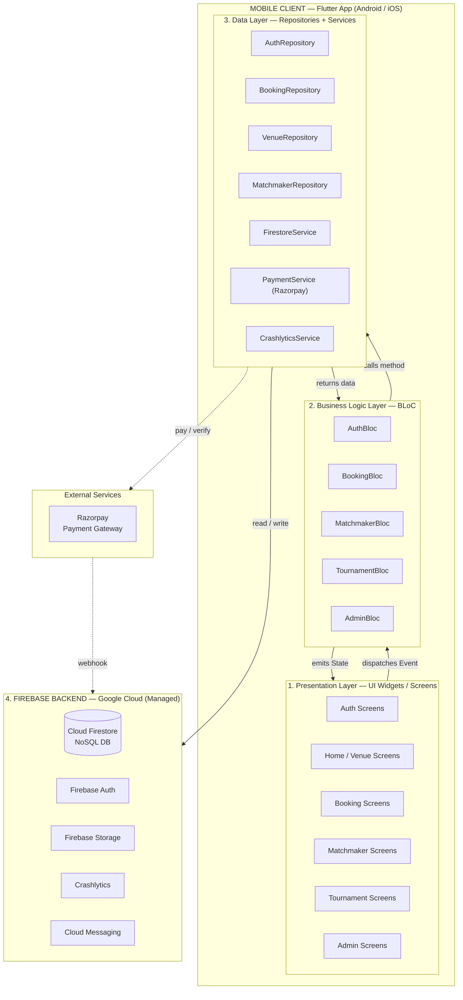

\newpage

## Layer-wise Responsibilities

### 1. Presentation Layer (`lib/presentation/`)

Pure Flutter widgets — stateless where possible; stateful only when local animation / form state is needed. This layer **does not know about Firebase or HTTP**; it only renders what the BLoC tells it to.

- Dispatches `Event` objects to the BLoC on user interaction.
- Listens to the BLoC's `State` stream and rebuilds widgets reactively.

### 2. Business Logic Layer — BLoC (`lib/bloc/`)

Each feature has its own BLoC (Business Logic Component). A BLoC:

- Receives an `Event` from the UI.
- Runs the business rule (validation, combining multiple data sources, orchestrating multi-step flows).
- Calls the appropriate method on a **Repository**.
- Emits a new `State` that the UI renders.

Key BLoCs in PlayArena: `AuthBloc`, `BookingBloc`, `MatchmakerBloc`, `TournamentBloc`, `AdminBloc`.

### 3. Data Layer — Repositories + Services (`lib/data/`)

- **Repositories** expose a domain-friendly API (e.g. `bookSlot()`, `loginWithOtp()`). The BLoC talks only to repositories — never directly to Firebase.
- **Services** wrap the raw Firebase SDK. `FirestoreService` centralises every Firestore call, converts `Timestamp` fields to ISO strings, and injects server-side timestamps on every create / update.
- **Models** are immutable Dart classes (using `Equatable`) with `fromJson` / `toJson` factories.

### 4. Backend Layer — Firebase (Managed Cloud)

| **Service** | **Responsibility** |
|:---|:---|
| Cloud Firestore | Primary NoSQL data store — users, venues, slots, bookings, matches, tournaments, reviews. |
| Firebase Auth | Identity & session tokens — email/password + phone OTP. |
| Firebase Storage | Binary blobs — venue images, user avatars, review photos. |
| Crashlytics | Captures unhandled errors and stack traces in production. |
| Cloud Messaging (FCM) | Push notifications for booking reminders and tournament updates. |
| Security Rules | Server-side enforcement of role-based access. |

\newpage

## Typical Data Flow — Example: Booking a Slot

The following example traces a single user action ("Book Now") through every layer of the architecture:

1. **User** taps *"Book Now"* in `BookingScreen` (Presentation Layer).
2. The screen dispatches a `BookSlotEvent(slotId, userId)` to `BookingBloc`.
3. `BookingBloc` validates business rules (slot is still available, user is logged in, amount is non-zero) and calls `BookingRepository.bookSlot(...)`.
4. `BookingRepository` delegates to `PaymentService` (Razorpay) to collect the payment, then calls `FirestoreService` to run an **atomic Firestore transaction** that:
   - Marks the slot's `isAvailable = false` and sets its `bookingId`.
   - Creates a new document in the `bookings` collection with status `upcoming` and `paymentStatus = completed`.
5. Firebase commits the transaction and returns the booking ID.
6. `BookingRepository` returns the booking object to `BookingBloc`.
7. `BookingBloc` emits `BookingSuccessState(booking)`.
8. `BookingScreen` listens to this state and navigates to `PaymentSuccessScreen`, which shows the QR code, receipt and "Share with friends" buttons.

This end-to-end flow keeps UI, business rules and data access strictly separated, making the system easy to unit-test, easy to evolve, and resilient to Firebase SDK changes (only the Service layer is affected).

\newpage

# SYSTEM FLOW DIAGRAM

- A system flow diagram is a way to show the relationships between a business and its components, such as customers, admins and services. System flow diagrams are also known as **"process flow diagrams"** or **"data flow diagrams."**

### What is Flow Diagram?

- System flows are system models that show the activities and decisions that a system executes from a user's perspective.

### What is System Diagram?

- A system diagram is a visual model of a system, its components and their interactions. With supporting documentation, it can capture all the essential information of a system's design — from user input at the UI layer, through business logic in the BLoC, down to data persistence in Firestore.

\newpage

## Symbols Used for System Flow Diagram

| **Symbol** | **Meaning** | **Description** |
|:---:|:---|:---|
| Oval | Start or End | The oval is used to represent the start and end of a process. |
| Rectangle | Process Step | A step in the flowcharting process; the rectangle is the go-to symbol for a single action. |
| Arrow | Direction / Flow | Shows the direction of flow from one step to the next. |
| Diamond | Decision | Represents a decision point that calls for a Yes/No or True/False choice. |

\newpage

## Extended Flowchart Symbols

| **Symbol (Visual)** | **Name** | **Meaning / Use** |
|:---:|:---|:---|
| Rounded Rectangle (oval) | Start / End | Represents the start or end of a process or system flow. |
| Arrow | Flow Direction | Shows the direction of flow from one step to another. |
| Parallelogram | Input / Output | Represents input to or output from a process (e.g. data entry, display). |
| Rectangle | Process | Represents a process step or action to be performed. |
| Diamond | Decision | Represents a decision point requiring a Yes/No or True/False choice. |

\newpage

## System Flow Diagram — PlayArena

\begin{center}
\textit{[Insert System Flow Diagram image here. Use the Mermaid source below — render at \textbf{mermaid.live}, export as PNG, and paste the image in place of this line.]}
\end{center}

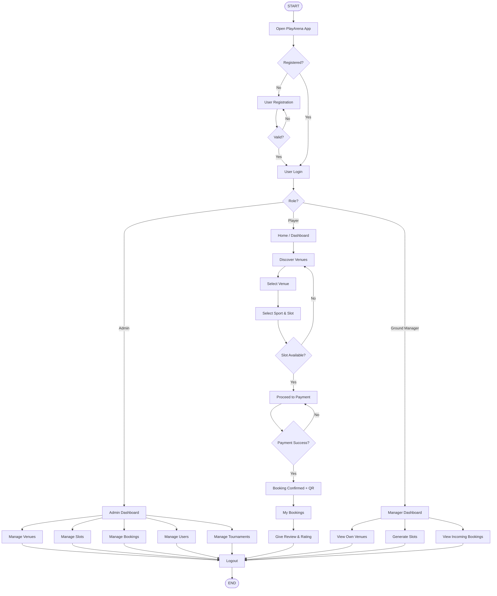

\newpage

# UML DIAGRAM

## What is UML and What Is It Used For?

- A **UML Diagram** is a diagram based on the UML (Unified Modeling Language) with the purpose of visually representing a system along with its main actors, roles, actions, artifacts or classes.
- It helps developers, designers and examiners to better understand, alter, maintain and document information about the system.
- UML is used by software developers across the industry.
- UML can be used to develop diagrams and provide users with ready-to-use, expressive modelling examples.

## Why Do We Use UML Diagrams?

- UML has applications beyond software development, such as business process flow in manufacturing and services.
- It is analogous to the blueprints used in other engineering fields and consists of different types of diagrams.
- In the aggregate, UML diagrams describe the **boundary, structure and behaviour** of the system and the objects within it.

\newpage

## Why Are UML Diagrams Important?

- The importance of using UML for modeling cannot be overstated.
- UML is a powerful tool that can greatly improve the quality of your system analysis and design.
- It is hoped that these improved practices will translate into higher-quality systems.

## What is the Need of UML Diagrams?

### Importance of UML Diagrams in Software Development

- The Unified Modeling Language (UML) is a standard language for specifying, visualising, constructing and documenting the artifacts of software systems as well as business modelling and other non-software systems.

## Advantages

- Provides a standard for software development.
- Reduces costs to develop diagrams of UML using supporting tools.
- Development time is reduced.
- Past issues faced by developers are minimised because the design is communicated clearly before coding starts.

\newpage

## Types of UML Diagrams Used in PlayArena

1. **Use Case Diagram**
2. **Activity Diagram**
3. **Sequence Diagram**
4. **Class Diagram**

\newpage

# USE CASE DIAGRAM

## Purpose of Use Case Diagram

- Use Case Diagram is one of the UML diagrams and its specific purpose is to **gather system requirements and actors**.
- Use Case Diagrams specify the events of a system and their flows.
- However, Use Case Diagrams never describe *how* these events are implemented — that belongs in sequence or activity diagrams.

## Importance of Use Cases

- Use cases are important because they are in a **tracking format**.
- They make it easy to comprehend the functional requirements in the system.
- They also make it easy to identify the various interactions between the users and the system within an environment.

\newpage

## Use Case Diagram Notations

| **Notation** | **Description** |
|:---|:---|
| **Actor** | Actors are usually individuals (or external systems) involved with the system, defined according to their roles. |
| **Use Case** | A use case describes how an actor uses a system to accomplish a particular goal. |
| **Relationship** | The relationships between and among the actors and the use cases. |
| **System Boundary** | Boundary that defines the whole system; actors are always outside of the system boundary. |

\newpage

## Symbols of Use Case Diagram

| **Symbol** | **Description** |
|:---:|:---|
| Stick figure | A user or system component that interacts with the system and initiates use cases. |
| Oval | A specific functionality or process performed by the system (manual or automated). |
| Solid line | Connects actors to use cases, representing interaction or communication. |
| `<<include>>` | One use case mandatorily calls another use case (reuse of functionality). |
| `<<extend>>` | Extend relationship between use cases — one calls another under a certain condition; think of it as decision-driven. |
| Rectangle | Encloses all system use cases, defining the system's scope and limits. |

\newpage

## Use Case Diagram — Admin Side

\begin{center}
\textit{[Insert Admin Use Case Diagram image. Render the Mermaid source below on mermaid.live and paste the exported PNG here.]}
\end{center}

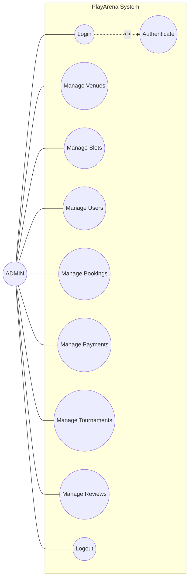

\newpage

## Use Case Diagram — User Side

\begin{center}
\textit{[Insert User Use Case Diagram image. Render the Mermaid source below and paste the exported PNG here.]}
\end{center}

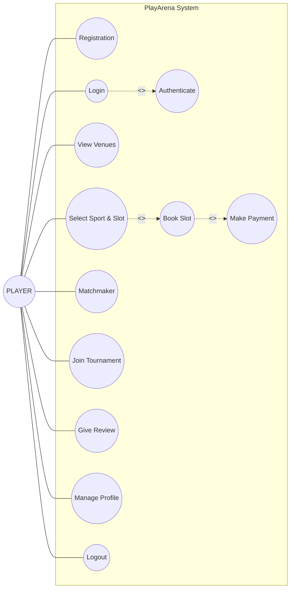

\newpage

# Activity Diagram

## What is Activity Diagram?

- An **Activity Diagram** is a type of UML (Unified Modelling Language) diagram used in software engineering and systems modelling to represent the flow of activities or processes within a system, business process, or workflow.
- It is a graphical representation that visually depicts the steps, actions and decisions involved in a particular process.
- Activity diagrams are considered a variation of **State Chart Diagrams**.

## Why do we use Activity Diagram?

- The basic usage of an Activity Diagram is similar to other UML diagrams.
- Its specific purpose is to **model the control flow from one activity to another**.
- This control flow does not include messages between objects or actors — that belongs to Sequence Diagrams.
- Activity Diagrams are suitable for modelling the activity flow of the system or business process.

## How do you write an Activity Diagram?

To draw an Activity Diagram from the beginning, follow these steps:

1. **Figure out the action steps** from the use case.
2. **Identify the actors** who are involved in the process.
3. **Find the flow** or sequence among the activities.
4. **Add swim lanes** if there are multiple actors or departments involved to clarify responsibilities.

## Elements of Activity Diagram

The fundamental elements of an activity diagram include:

- **Actions:** The tasks or activities performed.
- **Control Elements:** These govern the flow of activities and include:
  - **Decision:** A branching point where the flow can diverge based on conditions.
  - **Division (Fork):** Splitting of flow into concurrent paths.
  - **Merge (Join):** Bringing multiple flows back into a single path.
  - **Initiation:** The starting point of the activity flow.
  - And other control constructs.

\newpage

## What is a Swim Lane Diagram?

- A **Swim Lane Diagram** is a type of process flow diagram or flowchart that visually distinguishes job sharing and responsibilities for sub-processes within a business process. Swim lanes can be arranged either **horizontally** or **vertically** depending on design preferences.

## Usage of Swim Lane Diagram

- Swim Lane Diagrams are used to model business processes involving more than one department or role.
- They clarify not only the sequence of steps but also show **who is responsible for each step**.
- Swim lanes help identify potential delays, mistakes, or fraud risks by visually separating roles.
- These diagrams are widely used in **Business Process Modeling Notation (BPMN)** and **UML Activity Diagram** methodologies for clear responsibility assignments.

\newpage

## Symbols of Activity Diagram

| **Symbol** | **Name** | **Description** |
|:---:|:---|:---|
| Filled circle | Initial Node | The filled circle represents the starting point of the diagram. |
| Rounded Rectangle | Activity | Represents activities that occur. An activity may be manual or automated. |
| Arrow | Flow / Edge | Arrows show the flow from one activity or decision to another. |
| Diamond | Decision | One flow enters and several leave with conditions like Yes / No. |
| Horizontal bar | Fork | One flow enters and several leave; denotes the beginning of parallel activities. |
| Horizontal bar | Join | Several flows enter and one leaves; denotes the end of parallel activities. |
| Bullseye circle | Final Node | Represents the ending point of the diagram. The activity diagram can have zero or more final states. |

\newpage

## Activity Diagram — Admin Side

\begin{center}
\textit{[Insert Admin Activity Diagram image. Render the Mermaid source on mermaid.live and paste PNG here.]}
\end{center}

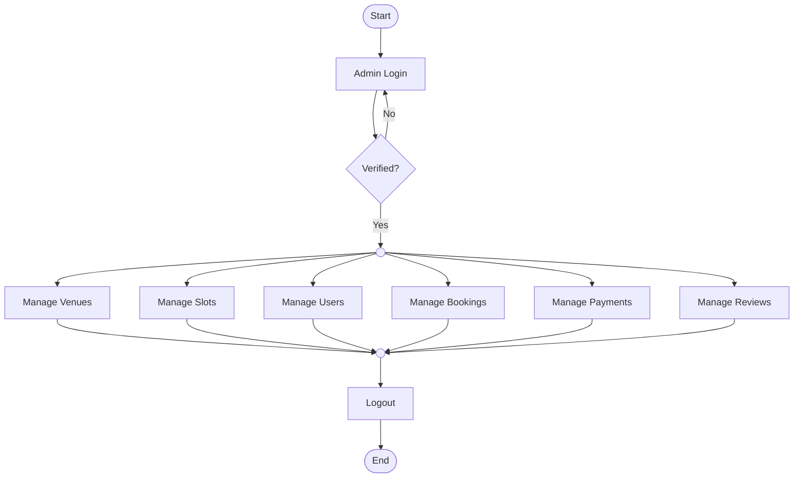

\newpage

## Activity Diagram — User Side

\begin{center}
\textit{[Insert User Activity Diagram image. Render the Mermaid source on mermaid.live and paste PNG here.]}
\end{center}

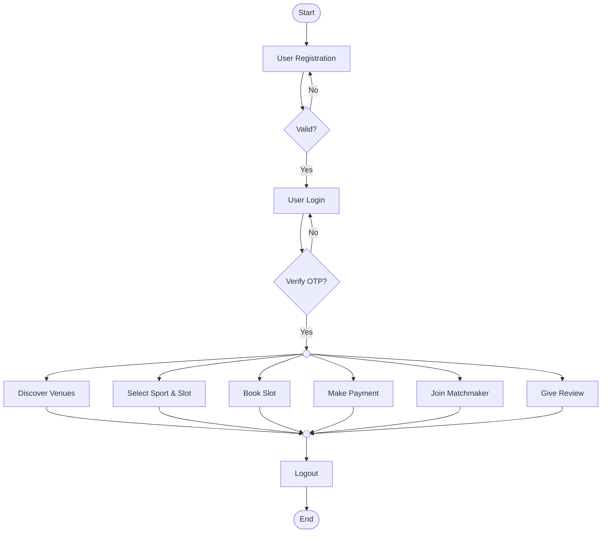

\newpage

# Sequence Diagram

## What is a Sequence Diagram?

- A **Sequence Diagram** is a type of UML (Unified Modelling Language) diagram used in software engineering and system design.
- It is used to **visualise the interactions and communication** between different components or objects within a system over a **specific period of time**.
- It shows the objects participating in the interaction by their *Lifelines* and the *Messages* they send to each other.

## What is a Sequence Diagram Used For?

- UML Sequence Diagrams model the **flow of logic** within your system in a visual manner.
- They help to **document and validate** the logic of the system.
- They are commonly used for both **Analysis and Design** purposes.

## Sequence Diagram Notations and Elements

### Basic Sequence Diagram Notations

- **Class Roles or Participants**: Describe the way an object will behave in a given context.
- **Activation or Execution Occurrence**: Activation boxes represent the time an object needs to complete a task.
- **Messages**: Represent communication between objects.
- **Lifelines**: Show the existence of an object over time.
- **Destroying Objects**: Represents the termination of objects during interaction.
- **Loops**: Used to denote repeated interactions.
- **Synchronous Message**: A message that requires a response before continuing.
- **Asynchronous Message**: A message that does not wait for a response to continue.

### Elements of a Sequence Diagram

The following nodes and edges are typically drawn in a UML Sequence Diagram:

- Lifeline
- Execution Specification
- Message
- Combined Fragment
- Interaction Use
- State Invariant
- Continuation
- Destruction Occurrence

\newpage

## Sequence Diagram Symbol Table

| **Symbol** | **Overview** |
|:---:|:---|
| Stick figure | **Actor** are the entities that interact with a system. Although in most cases actors represent the user of the system, actors can actually be anything that needs to exchange information with the system. So, an actor may be a person, a mobile device, another system, etc. |
| Named rectangle | **Lifeline:** A sequence diagram is made up of several lifeline notations arranged horizontally across the top of the diagram. No two lifelines should overlap each other. They represent the different objects or parts that interact with each other in the system during the sequence. |
| Thin vertical rectangle | **Activation:** Activation boxes represent the time an object needs to complete a task. When an object is busy executing a process or waiting for a reply message, use a thin grey rectangle placed vertically on its lifeline. |
| X at bottom | **Lifeline End:** Represents destruction / removal of the object. |
| Solid arrow + label | **Asynchronous Message:** used when the sender does not wait for a response; a normal arrow like in a flowchart. |
| Dotted arrow + open head | **Return Message:** a reply message drawn with a dotted line and an open arrowhead pointing back to the original lifeline. |
| U-shaped arrow | **Self-call:** a message an object sends to itself, usually shown as a U-shaped arrow pointing back to itself. |
| Alternative fragment | **alt:** This symbol has two parts: valid and invalid. The valid branch runs when the condition is true; the other (else) branch runs otherwise. |

\newpage

## Sequence Diagram — Admin Side

\begin{center}
\textit{[Insert Admin Sequence Diagram image. Render the Mermaid source on mermaid.live and paste PNG here.]}
\end{center}

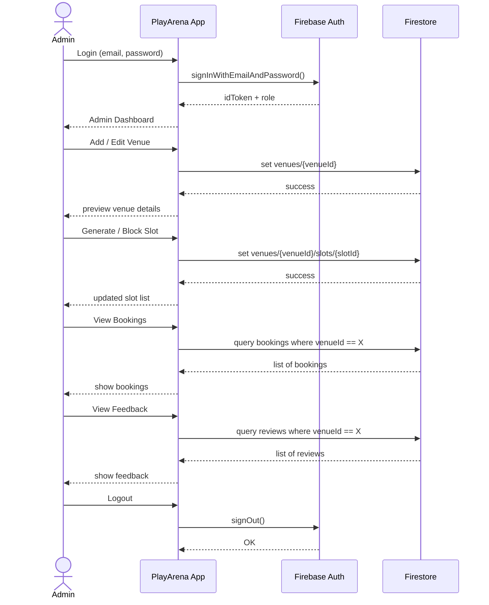

\newpage

## Sequence Diagram — User Side

\begin{center}
\textit{[Insert User Sequence Diagram image. Render the Mermaid source on mermaid.live and paste PNG here.]}
\end{center}

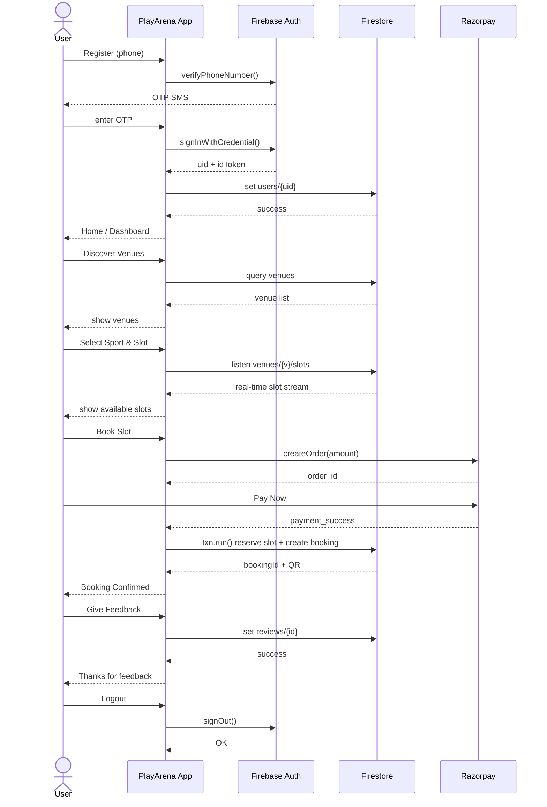

\newpage

# Class Diagram

## What is a Class Diagram?

- A **Class Diagram** is a type of UML (Unified Modelling Language) diagram used in software engineering and system design to visualise the structure of a system or application in terms of classes and their relationships.
- Class diagrams are primarily used to represent the **static aspects** of a system, focusing on:
  - Classes
  - Their attributes
  - Their methods (operations)
  - Relationships between classes

## How do you Identify Classes in a Class Diagram?

To identify classes, the following **analysis activities** are included:

- Identifying **objects** (often from use cases as a starting point).
- Identifying **associations** between objects.
- Identifying **general attributes** and **responsibilities** of objects.
- Modelling **interactions** between objects.
- Modelling how individual change state objects helps to identify operations.

## Components of Class Diagram

In Class Diagrams, we work with the following key elements:

- **Class:** Represents a relevant concept from the domain, such as a set of persons, objects, or ideas that are depicted in the IT system.
- **Attribute:** Defines the properties or characteristics of a class.
- **Generalization:** Shows inheritance between a general class (parent) and a more specific class (child).
- **Association:** Represents a relationship between two or more classes.
- **Multiplicity:** Defines how many instances of one class can be associated with instances of another class.
- **Aggregation:** A special form of association that represents a "whole-part" relationship between classes.

\newpage

## Class Diagram Symbol Table

| **Symbol** | **Name** | **Description** |
|:---:|:---|:---|
| Rectangle with 3 compartments (Name / Attributes / Operations) | Class | A class represents a concept that encapsulates state (attributes) and behaviour (operations). Each attribute has a type, and each operation has a signature. The class name is the only mandatory information. |
| Hollow-triangle arrow | Generalization | Another name for inheritance or an "is-a" relationship. It refers to a relationship between two classes where one class is a specialized version of another. |
| Solid line | Association | Represents static relationships between classes. Association names can be placed above, on, or below the association line. A filled arrow indicates the direction of the relationship. |
| `1 ------ M` | Multiplicity (1–M) | Represents a one-to-many relationship between classes. |
| `M ------ M` | Multiplicity (M–M) | Represents a many-to-many relationship between classes. |

\newpage

## Class Diagram — PlayArena

\begin{center}
\textit{[Insert Class Diagram image. Render the Mermaid source on mermaid.live and paste the exported PNG here.]}
\end{center}

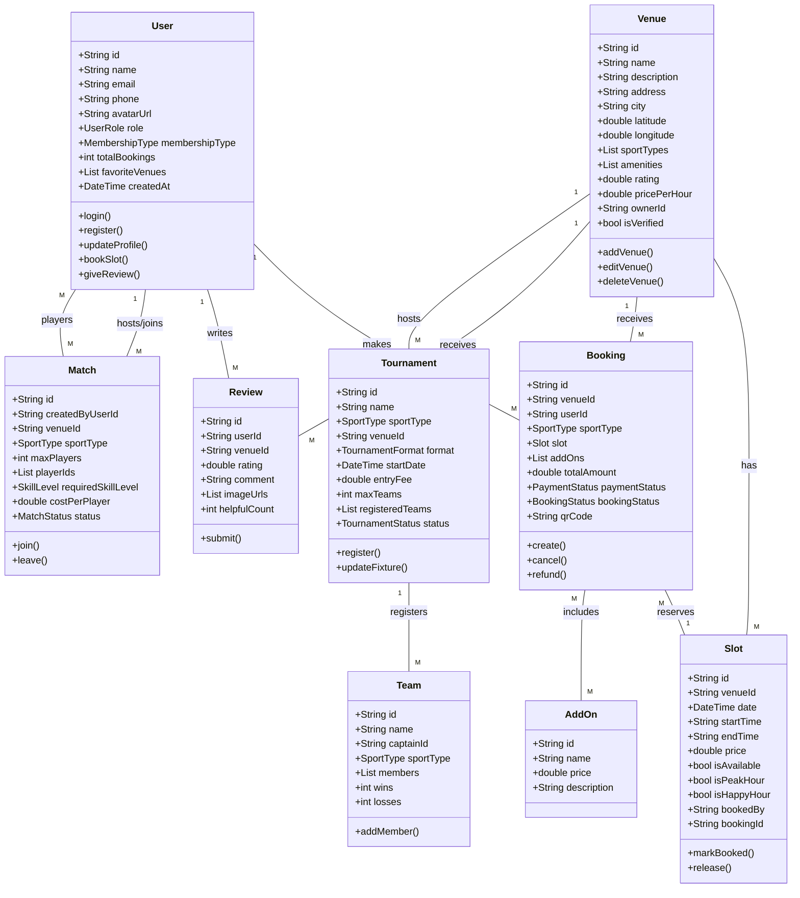

\newpage

# ER Diagram

## What is an ER Diagram?

- An **Entity Relationship Diagram (ERD)**, also known as an **Entity Relationship Model**, is a graphical representation that depicts relationships among *people, objects, places, concepts,* or *events* within an information technology (IT) system.
- ER Diagrams are built using components and concepts such as:
  - Entities
  - Relationships
  - Attributes
  - Primary Keys
  - Foreign Keys

## Why do we use ER Diagrams?

- ER Diagrams are most often used to **design or debug relational databases** in the fields of:
  - Software Engineering
  - Business Information Systems
  - Education and Research
- ER Diagrams are also often used **along with Data Flow Diagrams (DFDs)**, which map out the flow of information for processes or systems.
- Even for NoSQL backends like Cloud Firestore used in PlayArena, ERDs are extremely useful to visualise the *logical* structure of collections and the references between them.

\newpage

## ER Diagram Symbols

| **Symbol** | **Name** | **Description** |
|:---:|:---|:---|
| Ellipse | Attributes | Attributes are the characteristics of an entity. |
| Rectangle | Entity | An entity is an object or concept about which you want to store information. |
| Line | Links (Connector) | Links connect entity to entity, entity to attributes, or entity to relationships. |
| Diamond | Relationship | Represents a relationship. Entities can also be self-linked, e.g. an admin supervising other managers. |
| Underlined Ellipse | Key Attribute | A key attribute uniquely identifies an entity from an entity set (like a primary key). |
| Double Ellipse | Multivalued Attribute | A multivalued attribute can have more than one value — e.g. a venue has multiple `amenities`. |

\newpage

## ER Diagram — PlayArena

\begin{center}
\textit{[Insert ER Diagram image. Render the Mermaid source on mermaid.live and paste the exported PNG here.]}
\end{center}

```mermaid
erDiagram
    USERS ||--o{ BOOKINGS : makes
    USERS ||--o{ REVIEWS : writes
    USERS ||--o{ MATCHES : hosts
    USERS ||--o{ MATCH_REQUESTS : posts
    USERS }o--o{ TEAMS : member_of

    VENUES ||--o{ SLOTS : has
    VENUES ||--o{ BOOKINGS : receives
    VENUES ||--o{ REVIEWS : receives
    VENUES ||--o{ TOURNAMENTS : hosts

    SLOTS ||--|| BOOKINGS : reserved_by
    BOOKINGS }o--o{ ADD_ONS : includes

    TOURNAMENTS ||--o{ TEAMS : registers

    USERS {
        string id PK
        string name
        string email
        string phone
        string role
        string membershipType
        int totalBookings
        datetime createdAt
    }

    VENUES {
        string id PK
        string name
        string address
        string city
        double rating
        double pricePerHour
        string ownerId FK
        bool isVerified
        datetime createdAt
    }

    SLOTS {
        string id PK
        string venueId FK
        datetime date
        string startTime
        string endTime
        double price
        bool isAvailable
        string bookedBy FK
        string bookingId FK
    }

    BOOKINGS {
        string id PK
        string venueId FK
        string userId FK
        string sportType
        double totalAmount
        string paymentStatus
        string bookingStatus
        string qrCode
        datetime createdAt
    }

    MATCHES {
        string id PK
        string createdByUserId FK
        string venueId FK
        string sportType
        int maxPlayers
        string requiredSkillLevel
        string status
    }

    MATCH_REQUESTS {
        string id PK
        string hostUserId FK
        string sportType
        string venueId FK
        int playersNeeded
        string skillLevel
        string status
    }

    TEAMS {
        string id PK
        string name
        string captainId FK
        string sportType
        int wins
        int losses
    }

    TOURNAMENTS {
        string id PK
        string name
        string sportType
        string venueId FK
        string format
        datetime startDate
        double entryFee
        int maxTeams
        string status
    }

    REVIEWS {
        string id PK
        string userId FK
        string venueId FK
        double rating
        string comment
        int helpfulCount
    }

    ADD_ONS {
        string id PK
        string name
        double price
        string description
    }
```

\newpage

# Data Dictionary

## What is a Data Dictionary?

- A **Data Dictionary** is a structured repository or document that provides detailed information about the data used in a database or information system.
- Examples of information contained in a data dictionary include:
  - The **data types** of fields (e.g. integer, real, Character, image).
  - Details of all fields in an organisation's databases.

## Benefits of a Data Dictionary

There are several advantages of using a Data Dictionary in computer system analysis and design, such as:

- Data Clarity and Understanding
- Improved Data Documentation
- Data Consistency
- Efficient Data Management
- Data Quality Improvement
- Cost Savings
- Reduced Risk

## Why Do We Need a Data Dictionary?

- A data dictionary is used to provide **detailed information** about the contents of a dataset or database.
- It includes:
  - Names of measured variables
  - Their data types or formats
  - Text descriptions of data items
- A data dictionary thus provides a **concise guide to understanding and using the data** effectively.

> **Note:** PlayArena uses **Cloud Firestore** (NoSQL) as its backing database. The tables below represent the logical structure of each Firestore **collection**. "Size" values are indicative maximum lengths enforced in the app layer; Firestore itself does not enforce column sizes.

\newpage

## 1) USERS

**Collection path:** `users/{uid}`

| **ATTRIBUTE** | **CONSTRAINT** | **DATA TYPE** | **SIZE** | **DESCRIPTION** |
|:---|:---|:---|:---:|:---|
| id | PRIMARY KEY | String | 30 | Document ID, equals Firebase Auth UID. |
| name | NOT NULL | String | 50 | Full name of the user. |
| email | NOT NULL, UNIQUE | String | 100 | Email address of the user. |
| phone | NOT NULL | String | 15 | Phone number with country code. |
| avatarUrl | NULLABLE | String | 255 | URL of the user's profile picture (Firebase Storage). |
| role | NOT NULL | String (enum) | 15 | One of: `player`, `admin`, `groundManager`. |
| membershipType | NOT NULL | String (enum) | 10 | One of: `free`, `silver`, `gold`, `platinum`. |
| totalBookings | NOT NULL | Int | 5 | Total number of bookings made by the user. |
| favoriteVenues | NULLABLE | List\<String\> | — | List of favourite venue IDs. |
| createdAt | NOT NULL | Timestamp | 8 | Timestamp when the user account was created. |
| updatedAt | NULLABLE | Timestamp | 8 | Server timestamp set on every profile write. |

\newpage

## 2) VENUES

**Collection path:** `venues/{venueId}`

| **ATTRIBUTE** | **CONSTRAINT** | **DATA TYPE** | **SIZE** | **DESCRIPTION** |
|:---|:---|:---|:---:|:---|
| id | PRIMARY KEY | String | 30 | Unique venue document ID. |
| name | NOT NULL | String | 80 | Name of the venue. |
| description | NOT NULL | String | 500 | Description of the venue and its facilities. |
| address | NOT NULL | String | 200 | Street address of the venue. |
| city | NOT NULL | String | 50 | City where the venue is located. |
| latitude | NOT NULL | Double | 10 | Geographical latitude. |
| longitude | NOT NULL | Double | 10 | Geographical longitude. |
| imageUrls | NULLABLE | List\<String\> | — | List of URLs for images of the venue. |
| sportTypes | NOT NULL | List\<String\> | — | Sports offered: boxCricket, football, pickleball, badminton, tennis. |
| amenities | NULLABLE | List\<String\> | — | parking, cctv, shower, drinkingWater, changingRoom, cafeteria, firstAid, wifi, floodlights, scoreboard. |
| rating | NOT NULL | Double | 3 | Average user rating out of 5. |
| totalReviews | NOT NULL | Int | 5 | Total number of reviews. |
| pricePerHour | NOT NULL | Double | 8 | Standard booking price per hour. |
| peakPricePerHour | NOT NULL | Double | 8 | Peak-hour price per hour. |
| happyHourPrice | NOT NULL | Double | 8 | Discounted happy-hour price. |
| openTime | NOT NULL | String | 5 | Venue opening time (e.g. `06:00`). |
| closeTime | NOT NULL | String | 5 | Venue closing time (e.g. `23:00`). |
| isVerified | NOT NULL | Bool | 1 | Whether the venue has been verified by admins. |
| ownerId | FOREIGN KEY | String | 30 | Mapped with USERS — ground manager who owns the venue. |
| contactPhone | NOT NULL | String | 15 | Contact phone number for the venue. |
| availableSlots | NOT NULL | Int | 5 | Currently available booking slots. |
| totalSlots | NOT NULL | Int | 5 | Total capacity of booking slots. |
| rules | NOT NULL | String | 500 | Specific rules and regulations of the venue. |
| createdAt | NOT NULL | Timestamp | 8 | Server timestamp set when venue was created. |
| updatedAt | NULLABLE | Timestamp | 8 | Server timestamp updated on every write. |

\newpage

## 3) SLOTS

**Collection path:** `venues/{venueId}/slots/{slotId}` (sub-collection)

| **ATTRIBUTE** | **CONSTRAINT** | **DATA TYPE** | **SIZE** | **DESCRIPTION** |
|:---|:---|:---|:---:|:---|
| id | PRIMARY KEY | String | 30 | Unique slot document ID. |
| venueId | FOREIGN KEY | String | 30 | Mapped with VENUES table. |
| date | NOT NULL | Timestamp | 8 | Date of the slot. |
| startTime | NOT NULL | String | 5 | Start time of the slot (HH:mm). |
| endTime | NOT NULL | String | 5 | End time of the slot (HH:mm). |
| duration | NOT NULL | Int | 3 | Duration of the slot in minutes. |
| price | NOT NULL | Double | 8 | Price for this specific slot block. |
| isAvailable | NOT NULL | Bool | 1 | Whether the slot can currently be booked. |
| isHappyHour | NOT NULL | Bool | 1 | Indicates if this slot falls under happy-hour pricing. |
| isPeakHour | NOT NULL | Bool | 1 | Indicates if this slot falls under peak-hour pricing. |
| bookedBy | NULLABLE, FOREIGN KEY | String | 30 | User ID of the person who booked the slot. |
| bookingId | NULLABLE, FOREIGN KEY | String | 30 | Booking document ID that holds this slot. |
| createdAt | NOT NULL | Timestamp | 8 | Server timestamp when the slot was first generated. |
| updatedAt | NULLABLE | Timestamp | 8 | Server timestamp updated on availability change. |

\newpage

## 4) BOOKINGS

**Collection path:** `bookings/{bookingId}`

| **ATTRIBUTE** | **CONSTRAINT** | **DATA TYPE** | **SIZE** | **DESCRIPTION** |
|:---|:---|:---|:---:|:---|
| id | PRIMARY KEY | String | 30 | Unique booking ID. |
| venueId | FOREIGN KEY | String | 30 | Mapped with VENUES table. |
| venueName | NOT NULL | String | 80 | Name of the venue at the time of booking. |
| userId | FOREIGN KEY | String | 30 | Mapped with USERS table. |
| userName | NOT NULL | String | 50 | Name of the user at time of booking. |
| sportType | NOT NULL | String | 15 | The sport specific to this booking. |
| slot | EMBEDDED | Map (SlotModel) | — | Embedded object with slot details. |
| addOns | NULLABLE | List\<Map\> | — | List of additional items purchased with the booking. |
| totalAmount | NOT NULL | Double | 8 | Total cost of the booking (slot + add-ons). |
| paymentStatus | NOT NULL | String (enum) | 10 | pending, completed, failed, refunded. |
| bookingStatus | NOT NULL | String (enum) | 10 | upcoming, ongoing, completed, cancelled. |
| qrCode | NULLABLE | String | 255 | QR-code string for entry verification. |
| splitPayment | NULLABLE | List\<Map\> | — | Details of split payments with friends. |
| createdAt | NOT NULL | Timestamp | 8 | Timestamp of when the booking was made. |
| updatedAt | NULLABLE | Timestamp | 8 | Server timestamp updated on every write. |
| cancelledAt | NULLABLE | Timestamp | 8 | Set when booking is cancelled. |

\newpage

## 5) MATCHES (Pickup)

**Collection path:** `matches/{matchId}`

| **ATTRIBUTE** | **CONSTRAINT** | **DATA TYPE** | **SIZE** | **DESCRIPTION** |
|:---|:---|:---|:---:|:---|
| id | PRIMARY KEY | String | 30 | Unique match ID. |
| createdByUserId | FOREIGN KEY | String | 30 | User ID of the organiser. |
| createdByUserName | NOT NULL | String | 50 | Name of the organiser. |
| venueId | FOREIGN KEY | String | 30 | Venue at which the match is held. |
| venueName | NOT NULL | String | 80 | Name of the venue. |
| sportType | NOT NULL | String | 15 | The sport being played. |
| matchDate | NOT NULL | Timestamp | 8 | Date of the match. |
| startTime | NOT NULL | String | 5 | Start time (HH:mm). |
| endTime | NOT NULL | String | 5 | End time (HH:mm). |
| maxPlayers | NOT NULL | Int | 3 | Maximum players allowed. |
| currentPlayers | NOT NULL | Int | 3 | Current number of players joined. |
| playerIds | NULLABLE | List\<String\> | — | List of player user IDs. |
| requiredSkillLevel | NOT NULL | String (enum) | 15 | beginner, intermediate, advanced, professional. |
| costPerPlayer | NOT NULL | Double | 8 | Cost each player contributes. |
| status | NOT NULL | String (enum) | 15 | open, full, inProgress, completed, cancelled. |
| notes | NULLABLE | String | 300 | Additional notes by the organiser. |
| createdAt | NOT NULL | Timestamp | 8 | Timestamp when match was created. |

\newpage

## 6) MATCH_REQUESTS

**Collection path:** `matchRequests/{requestId}`

| **ATTRIBUTE** | **CONSTRAINT** | **DATA TYPE** | **SIZE** | **DESCRIPTION** |
|:---|:---|:---|:---:|:---|
| id | PRIMARY KEY | String | 30 | Unique request ID. |
| hostUserId | FOREIGN KEY | String | 30 | User looking for players. |
| hostName | NOT NULL | String | 50 | Name of the host. |
| sportType | NOT NULL | String | 15 | Sport to be played. |
| venueId | FOREIGN KEY | String | 30 | Intended venue ID. |
| venueName | NOT NULL | String | 80 | Intended venue name. |
| date | NOT NULL | Timestamp | 8 | Date of play. |
| time | NOT NULL | String | 5 | Time of play. |
| playersNeeded | NOT NULL | Int | 3 | Number of additional players required. |
| playersJoined | NULLABLE | List\<String\> | — | List of user IDs who agreed to join. |
| skillLevel | NOT NULL | String (enum) | 15 | beginner, intermediate, advanced, any. |
| description | NOT NULL | String | 300 | Text description of the request. |
| status | NOT NULL | String (enum) | 15 | open, full, cancelled, completed. |
| createdAt | NOT NULL | Timestamp | 8 | Timestamp when request was created. |
| updatedAt | NULLABLE | Timestamp | 8 | Server timestamp updated on every write. |

\newpage

## 7) TEAMS

**Collection path:** `teams/{teamId}`

| **ATTRIBUTE** | **CONSTRAINT** | **DATA TYPE** | **SIZE** | **DESCRIPTION** |
|:---|:---|:---|:---:|:---|
| id | PRIMARY KEY | String | 30 | Unique team ID. |
| name | NOT NULL | String | 50 | Team name. |
| captainId | FOREIGN KEY | String | 30 | User ID of the team captain. |
| captainName | NOT NULL | String | 50 | Name of the team captain. |
| sportType | NOT NULL | String | 15 | The sport this team plays. |
| members | NOT NULL | List\<Map\> | — | Embedded list of team members (userId, name, role). |
| matchesPlayed | NOT NULL | Int | 5 | Lifetime matches played. |
| wins | NOT NULL | Int | 5 | Total wins. |
| losses | NOT NULL | Int | 5 | Total losses. |
| rating | NOT NULL | Double | 5 | Calculated ELO / skill rating. |

\newpage

## 8) TOURNAMENTS

**Collection path:** `tournaments/{tournamentId}`

| **ATTRIBUTE** | **CONSTRAINT** | **DATA TYPE** | **SIZE** | **DESCRIPTION** |
|:---|:---|:---|:---:|:---|
| id | PRIMARY KEY | String | 30 | Unique tournament ID. |
| name | NOT NULL | String | 80 | Name of the tournament. |
| sportType | NOT NULL | String | 15 | The sport being played. |
| venueId | FOREIGN KEY | String | 30 | Hosting venue ID. |
| venueName | NOT NULL | String | 80 | Hosting venue name. |
| format | NOT NULL | String (enum) | 15 | knockout, roundRobin, league. |
| startDate | NOT NULL | Timestamp | 8 | Start date and time. |
| endDate | NOT NULL | Timestamp | 8 | Expected end date and time. |
| entryFee | NOT NULL | Double | 8 | Cost for a team to enter. |
| prizePool | NOT NULL | Double | 10 | Total prize money to be distributed. |
| maxTeams | NOT NULL | Int | 3 | Maximum teams allowed. |
| registeredTeams | NULLABLE | List\<String\> | — | List of Team IDs registered. |
| matches | NULLABLE | List\<Map\> | — | Embedded list of tournament fixtures. |
| status | NOT NULL | String (enum) | 15 | upcoming, ongoing, completed. |
| rules | NOT NULL | String | 500 | Rules and regulations for the event. |
| createdAt | NOT NULL | Timestamp | 8 | Timestamp when tournament was created. |
| updatedAt | NULLABLE | Timestamp | 8 | Server timestamp updated on every write. |

\newpage

## 9) REVIEWS

**Collection path:** `venues/{venueId}/reviews/{reviewId}` and mirror at `reviews/{reviewId}`

| **ATTRIBUTE** | **CONSTRAINT** | **DATA TYPE** | **SIZE** | **DESCRIPTION** |
|:---|:---|:---|:---:|:---|
| id | PRIMARY KEY | String | 30 | Unique review ID. |
| userId | FOREIGN KEY | String | 30 | Mapped with USERS table. |
| userName | NOT NULL | String | 50 | Name of the user. |
| userAvatarUrl | NULLABLE | String | 255 | URL to user's avatar at review time. |
| venueId | FOREIGN KEY | String | 30 | Mapped with VENUES table. |
| rating | NOT NULL | Double | 3 | Rating given out of 5. |
| comment | NOT NULL | String | 500 | Text content of the review. |
| imageUrls | NULLABLE | List\<String\> | — | URLs of photos attached to the review. |
| createdAt | NOT NULL | Timestamp | 8 | Timestamp when review was submitted. |
| helpfulCount | NOT NULL | Int | 5 | Number of users who marked this review as helpful. |

\newpage

## 10) ADD_ONS

**Collection path:** `addOns/{addOnId}`

| **ATTRIBUTE** | **CONSTRAINT** | **DATA TYPE** | **SIZE** | **DESCRIPTION** |
|:---|:---|:---|:---:|:---|
| id | PRIMARY KEY | String | 30 | Unique add-on ID. |
| name | NOT NULL | String | 50 | Name of the add-on (e.g. 'Tennis Racket'). |
| price | NOT NULL | Double | 8 | Cost to rent / purchase the item. |
| description | NULLABLE | String | 200 | Description of the add-on. |
| iconUrl | NULLABLE | String | 255 | URL of icon / image for the add-on. |

\newpage

# Screen Layouts

*(The following pages contain annotated screenshots of every user and admin screen in PlayArena. Each screen is captured from the running Flutter app on an Android device and Android Studio Pixel 6 emulator.)*

\newpage

# USER LAYOUT

## 14.1 Splash / Onboarding

\begin{center}
\textit{[Insert screenshot: lib/presentation/screens/onboarding/onboarding\_screen.dart]}
\end{center}

**DESCRIPTION:** This is the first screen shown when the app is launched. It displays the PlayArena logo, a tagline and an onboarding carousel introducing the four main features — discover, book, play, connect — before the user registers or logs in.

\newpage

## 14.2 User Registration

\begin{center}
\textit{[Insert screenshot: lib/presentation/screens/auth/register\_screen.dart]}
\end{center}

**DESCRIPTION:** A simple account registration form with fields for name, email, phone number and password. On submit, the phone number is verified via Firebase Auth OTP before the user account is created in the `users` collection.

\newpage

## 14.3 User Login (Email / OTP)

\begin{center}
\textit{[Insert screenshot: lib/presentation/screens/auth/login\_screen.dart]}
\end{center}

**DESCRIPTION:** This image shows the login interface. The user can sign in either using email + password or phone number + OTP. "Forgot password?" and "Don't have an account? Register" links are available.

\newpage

## 14.4 Home / Dashboard

\begin{center}
\textit{[Insert screenshot: lib/presentation/screens/home/home\_screen.dart]}
\end{center}

**DESCRIPTION:** This screen displays the user dashboard with a welcome banner, quick-access tiles for "Explore Venues", "My Bookings", "Matchmaker" and "Tournaments", plus sections for ongoing offers, voucher wallet and popular sports in the area.

\newpage

## 14.5 Venue Listing

\begin{center}
\textit{[Insert screenshot: lib/presentation/screens/home/venues\_list (or similar).dart]}
\end{center}

**DESCRIPTION:** Shows all available venues in a scrollable grid. Each card shows the venue photo, name, city, rating, supported sports and starting price. Users can filter by sport, city, rating and price range.

\newpage

## 14.6 Venue Detail

\begin{center}
\textit{[Insert screenshot: venue detail screen]}
\end{center}

**DESCRIPTION:** This screen shows full details of a selected venue — image gallery, full address, list of sports, amenities, opening hours, rules, pricing breakdown (regular / peak / happy-hour) and recent reviews.

\newpage

## 14.7 Select Sport & Slot

\begin{center}
\textit{[Insert screenshot: lib/presentation/screens/booking/booking\_screen.dart]}
\end{center}

**DESCRIPTION:** This screenshot is about selecting a sport, a date and a time slot. The screen shows a calendar, horizontally-scrollable time-slot chips and the calculated price for the selected slot.

\newpage

## 14.8 Booking Confirmation

\begin{center}
\textit{[Insert screenshot: lib/presentation/screens/booking/booking\_confirmation\_screen.dart]}
\end{center}

**DESCRIPTION:** This screen is about showing booking details (venue, date, time, quantity, price) and the total amount before the user proceeds to payment. The user can also choose to split the payment with friends.

\newpage

## 14.9 Payment

\begin{center}
\textit{[Insert screenshot: Razorpay checkout sheet]}
\end{center}

**DESCRIPTION:** Razorpay secure payment gateway is opened as a bottom sheet. The user can pay via UPI, credit / debit card, net-banking or wallet. Once payment is successful, the booking is reserved atomically in Firestore.

\newpage

## 14.10 Payment Success / Receipt

\begin{center}
\textit{[Insert screenshot: lib/presentation/screens/booking/payment\_success\_screen.dart]}
\end{center}

**DESCRIPTION:** This screenshot shows the booking receipt — receipt number, transaction ID, venue, date, time, quantity, address, payment type and status. The user can download the receipt as PDF, scan the QR code at the venue gate, or give feedback after the match.

\newpage

## 14.11 My Bookings

\begin{center}
\textit{[Insert screenshot: lib/presentation/screens/booking/my\_bookings\_screen.dart]}
\end{center}

**DESCRIPTION:** It shows the user's booked slot details in a tabular form — sport, date, time, quantity, amount and status (BOOKED / PENDING / CANCELLED). Action buttons allow the user to download receipt, give feedback or cancel the booking.

\newpage

## 14.12 Matchmaker

\begin{center}
\textit{[Insert screenshot: lib/presentation/screens/matchmaker/matchmaker\_screen.dart]}
\end{center}

**DESCRIPTION:** This screen lists all open pickup matches near the user filtered by sport and skill level. Each card shows the host's name, venue, date/time, players needed and cost per player. The user can tap "Join" to instantly reserve a spot.

\newpage

## 14.13 Tournaments

\begin{center}
\textit{[Insert screenshot: tournaments screen]}
\end{center}

**DESCRIPTION:** A tournament browsing screen with upcoming, ongoing and completed events. Each card shows name, sport, format (knockout / round-robin / league), entry fee, prize pool and number of teams registered. Users can register their team from here.

\newpage

## 14.14 Profile & Settings

\begin{center}
\textit{[Insert screenshot: lib/presentation/screens/profile/profile\_screen.dart and lib/presentation/screens/settings/settings\_screen.dart]}
\end{center}

**DESCRIPTION:** Shows the user's avatar, name, membership tier, total bookings and favourite venues. From settings the user can change avatar, update phone / email, manage notifications, view Terms & Conditions, Contact Us or log out.

\newpage

# ADMIN LAYOUT

\newpage

## 15.1 Admin Login

\begin{center}
\textit{[Insert screenshot: Admin Login screen]}
\end{center}

**DESCRIPTION:** This image shows a secure admin login interface, branded as the "Control Room" of PlayArena. Access is restricted to users whose Firestore profile has `role == admin` or `role == groundManager`.

\newpage

## 15.2 Admin Dashboard

\begin{center}
\textit{[Insert screenshot: lib/presentation/screens/admin/admin\_dashboard\_screen.dart]}
\end{center}

**DESCRIPTION:** This screenshot is about the admin control centre. Aggregate KPIs are displayed as cards: Total Users, Total Venues, Total Bookings, Total Feedback. Quick-action buttons take the admin to Manage Venues or Manage Slots.

\newpage

## 15.3 Manage Venues

\begin{center}
\textit{[Insert screenshot: lib/presentation/screens/admin/admin\_venues\_screen.dart and admin\_add\_venue\_screen.dart]}
\end{center}

**DESCRIPTION:** This screenshot shows Add, Edit and Delete operations on venues and sports. The admin can upload venue images, set pricing (regular / peak / happy-hour), configure amenities and verify newly added venues.

\newpage

## 15.4 Manage Slots

\begin{center}
\textit{[Insert screenshot: lib/presentation/screens/admin/admin\_manage\_slots\_screen.dart]}
\end{center}

**DESCRIPTION:** It is used to manage and view all game slots with their date, time and availability status. The admin can generate bulk slots for the next 7/30 days or block specific slots for maintenance.

\newpage

## 15.5 Manage Bookings

\begin{center}
\textit{[Insert screenshot: lib/presentation/screens/admin/admin\_bookings\_screen.dart]}
\end{center}

**DESCRIPTION:** Shows every booking made across the platform with user, sport, slot, amount, status and payment status. The admin can cancel and refund bookings, scan the QR code for entry and filter by date / venue / status.

\newpage

## 15.6 Venue-wise Bookings

\begin{center}
\textit{[Insert screenshot: lib/presentation/screens/admin/admin\_venue\_bookings\_screen.dart]}
\end{center}

**DESCRIPTION:** Shows bookings filtered for a single venue — useful for ground managers who own multiple venues. Revenue per day, week and month is visualised as charts.

\newpage

## 15.7 Admin Profile

\begin{center}
\textit{[Insert screenshot: lib/presentation/screens/admin/admin\_profile\_screen.dart]}
\end{center}

**DESCRIPTION:** The admin can update his own profile, change password, manage which venues he operates, and view activity logs. A **Logout** button returns the user to the login screen.

\newpage

# FUTURE ENHANCEMENT

**1. Web and Desktop Apps**

Extend the existing Flutter code base to run on Web (admin panel) and macOS / Windows desktops for venue owners with a laptop at the reception counter.

**2. AI-Based Recommendations**

Suggest venues, time slots and pickup matches based on the user's past booking history, location, skill level and friend network using Cloud Functions + Vertex AI.

**3. Push Notifications & SMS**

Send booking confirmations, upcoming-match reminders, tournament updates and personalised offers via Firebase Cloud Messaging and SMS.

**4. Live Streaming of Matches**

Integrate a live streaming module (using Agora / 100ms) so that tournament matches can be broadcast to a public audience within the app.

**5. In-app Coach Booking**

Allow certified coaches to register on the platform and take one-to-one sessions bookable through the same slot engine.

**6. Wearable Integration**

Integrate with Apple Watch / Wear OS to capture heart rate, calories and step count during a match and store it as part of the user's playing history.

**7. Multilingual Support**

Add Hindi, Gujarati and regional Indian languages to broaden the user base in Tier-2 / Tier-3 cities.

**8. Loyalty & Referral Program**

Launch a coin-based loyalty system — users earn coins on every booking, referral or tournament win and redeem them against future bookings.

\newpage

# CONCLUSION

- In conclusion, our project **PlayArena** is a cross-platform mobile application that makes sports-venue slot booking fast, transparent and collaborative. Users can select venues, choose their preferred sport and time slot, split the cost with friends and make payments online — all without ever visiting the venue physically.

- This system reduces manual work, saves time and eliminates booking confusion such as double-booking or disputed cash payments. It is user-friendly and secure for both players and venue administrators.

- From this project, we learned modern mobile development with **Flutter and Dart**, the BLoC state-management pattern, real-time cloud databases using **Firebase Firestore**, secure authentication with Firebase Auth, integrated payments with Razorpay, and how to build a real-world multi-role production system.

- In future, we plan to improve the system by adding AI-based recommendations, live match streaming, in-app coach booking, multilingual support and a loyalty / referral programme.

- This project also helps in the better **management of sports venues and user data**, making the system more organised for owners and richer in experience for players.

- Overall, PlayArena improves the sports-booking experience by providing easy booking, quick access, real-time availability and a connected player community — transforming a traditionally offline, fragmented experience into a seamless digital platform.

\newpage

# BIBLIOGRAPHY

- https://flutter.dev/ — Official Flutter documentation.
- https://dart.dev/ — Official Dart language documentation.
- https://firebase.google.com/docs — Firebase documentation (Auth, Firestore, Storage, Crashlytics).
- https://bloclibrary.dev/ — flutter_bloc official documentation.
- https://pub.dev/ — Dart / Flutter packages repository.
- https://razorpay.com/docs/ — Razorpay Flutter integration guide.
- https://playo.co/ — Reference product for sports-venue booking UX.
- https://hudle.in/ — Reference product for sports-venue booking UX.
- https://www.bookmyturf.com/ — Reference product for turf booking.
- https://material.io/ — Material 3 Design guidelines.
- https://www.w3schools.com/ — General web-technology reference.
- https://chat.openai.com/ — ChatGPT for code explanation and documentation help.
- https://stackoverflow.com/ — Community Q&A for Flutter / Firebase.
- https://github.com/ — Open-source Flutter and Firebase sample projects.

\newpage

# Log-sheet

*(The following page contains the project log-sheet, filled week by week and signed by the project guide Prof. AyushSingh Kushwaha.)*

| **Week** | **Date** | **Work Done** | **Guide Remarks** | **Sign** |
|:---:|:---|:---|:---|:---:|
| 1 | | Project title finalised, requirement analysis | | |
| 2 | | Technology selection (Flutter + Firebase), UI wireframes | | |
| 3 | | Firebase Auth + Firestore setup, user registration module | | |
| 4 | | Login (email & OTP) + role-based routing | | |
| 5 | | Venue listing and venue detail screens | | |
| 6 | | Slot model + real-time slot availability | | |
| 7 | | Booking flow + Razorpay integration | | |
| 8 | | My Bookings + QR code + cancel / refund flow | | |
| 9 | | Matchmaker module (host / join / match-request) | | |
| 10 | | Tournaments module (teams + fixtures) | | |
| 11 | | Admin dashboard, venue / slot management | | |
| 12 | | Reviews, ratings, profile settings | | |
| 13 | | Testing (unit + integration + manual) | | |
| 14 | | Bug fixing, documentation, report writing | | |

\vspace{2cm}

\begin{center}
\textbf{End of Document}
\end{center}
